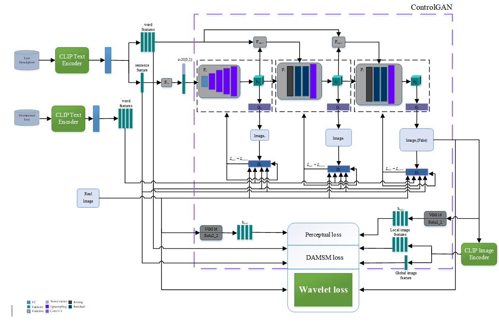
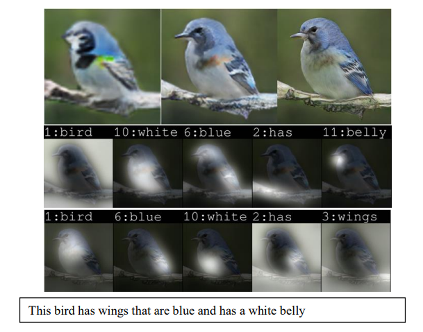
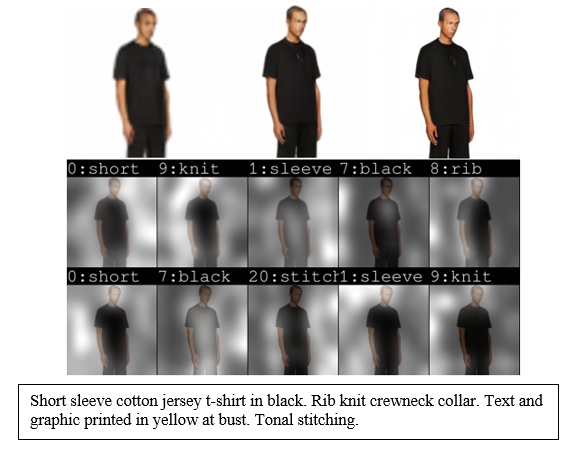

# CW-ControlGAN
Pytorch implementation for CW-ControlGAN Text-to-Image Generation. Text-to-image generation is called the method that translates human textual descriptions in the form of keywords or sentences into images with the same semantic content as text. The generated image in this field should match the meaning and content of the text and also have an acceptable quality.


### Overview

**[Text to fashion image synthesis Via CW-ControlGAN](https://papers.nips.cc/paper/8480-controllable-text-to-image-generation.pdf).**  
<br> In IEEE-20th CSI International Symposium on Artificial Intelligence and Signal Processing (AISP), 2023. <br>

### Data
1. Download the preprocessed metadata for [bird](https://drive.google.com/file/d/1MIpa-zWbvoY8e8YhvT4rYBNE6S_gkQMJ/view?usp=sharing) and [coco](https://drive.google.com/file/d/1GOEl9lxgSsWUWOXkZZrch08GgPADze7U/view?usp=sharing), and save both into `data/`
2. Download [bird](http://www.vision.caltech.edu/visipedia/CUB-200-2011.html) dataset and extract the images to `data/birds/`
3. Download [coco](http://cocodataset.org/#download) dataset and extract the images to `data/coco/`
4. Download [FashionGEN-Train](https://drive.google.com/file/d/1KqhVoDbPxRlVgcr8E3qgP3j0tN8fmxeu/view?usp=sharing), [FashionGEN-test](https://drive.google.com/file/d/1dqWVKyKQqRF81Nrl7_LheVDNVaGNgTEA/view?usp=sharing) and [example-test](https://drive.google.com/drive/folders/16h4kFSQ1IXi1bIIpM3ArdjaYDHSCdET2?usp=sharing) dataset and save to `data/fashiongen/`
   
### Training
All code was developed and tested on CentOS 7 with Python 3.7 (Anaconda) and PyTorch 1.1.

#### [DAMSM](https://github.com/taoxugit/AttnGAN) model includes text encoder and image encoder
- Pre-train DAMSM model for bird dataset:
```
python pretrain_DAMSM.py --cfg cfg/DAMSM/bird.yml --gpu 0
```
- Pre-train DAMSM model for coco dataset: 
```
python pretrain_DAMSM.py --cfg cfg/DAMSM/coco.yml --gpu 0
```
- Pre-train DAMSM model for fashiongen dataset: 
```
python pretrain_DAMSM.py --cfg cfg/DAMSM/fashiongen2.yml --gpu 0
```
```
python pretrain_DAMSM.py --cfg cfg/DAMSM/fashiongen.yml --gpu 0
```
#### CW-ControlGAN model 
- Train CW-ControlGAN model for bird dataset:
```
python main.py --cfg cfg/train_bird.yml --gpu 0
```
- Train CW-ControlGAN model for coco dataset: 
```
python main.py --cfg cfg/train_coco.yml --gpu 0
```
- Train CW-ControlGAN model for coco fashiongen: 
```
python main.py --cfg cfg/train_fashiongen2.yml --gpu 0
```

`*.yml` files include configuration for training and testing.

### Testing
- Test CW-ControlGAN model for bird dataset:
```
python main.py --cfg cfg/eval_bird.yml --gpu 0
```
- Test CW-ControlGAN model for coco dataset: 
```
python main.py --cfg cfg/eval_coco.yml --gpu 0
```
- Test CW-ControlGAN model for fashiongen dataset: 
```
python main.py --cfg cfg/eval_fashiongen2.yml --gpu 0
```

### Evaluation
- To generate images for all captions in the testing dataset, change B_VALIDATION to `True` in the eval_*.yml. 
- Inception Score for bird dataset: [StackGAN-inception-model](https://drive.google.com/file/d/1dB40D7HbrqD6oSEWMAWfVB7vx27PBi7d/view?usp=drive_link).
- Inception Score for coco dataset: [improved-gan/inception_score](https://github.com/openai/improved-gan/tree/master/inception_score).
- Download [inception](https://drive.google.com/file/d/1A0Ib86vVMcd2hflTuc8jisDFxrGTWo5A/view?usp=drive_link) for FID and save into `metrics/FID/res/`


### Code Structure
- code/main.py: the entry point for training and testing.
- code/trainer.py: creates the main networks, harnesses and reports the progress of training.
- code/model.py: defines the architecture of ControlGAN.
- code/attention.py: defines the spatial and channel-wise attentions.
- code/VGGFeatureLoss.py: defines the architecture of the VGG-16.
- code/datasets.py: defines the class for loading images and captions.
- code/pretrain_DAMSM.py: creates the text and image encoders, harnesses and reports the progress of training. 
- code/miscc/losses.py: defines and computes the losses.
- code/miscc/config.py: creates the option list.
- code/miscc/utils.py: additional functions.

### Acknowledgements
This code borrows heavily from [ControlGAN](https://github.com/mrlibw/ControlGAN) and [FashionGenAttnGAN](https://github.com/menardai/FashionGenAttnGAN) repository. Many thanks.

